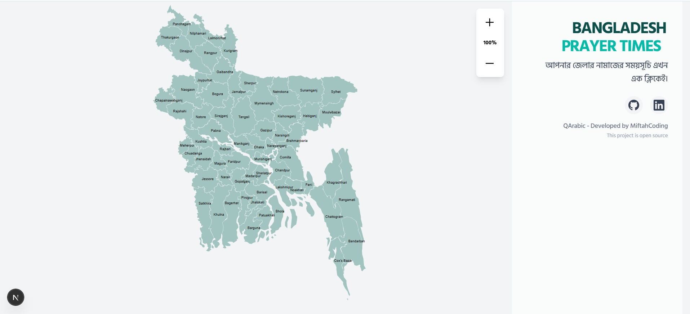
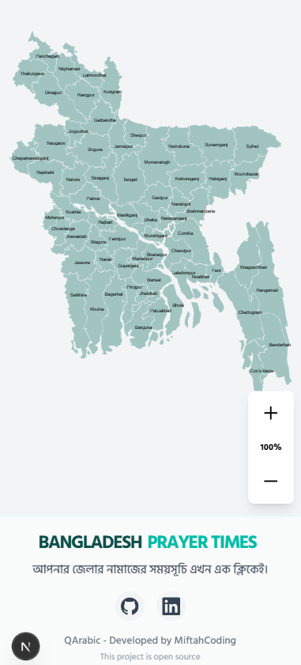
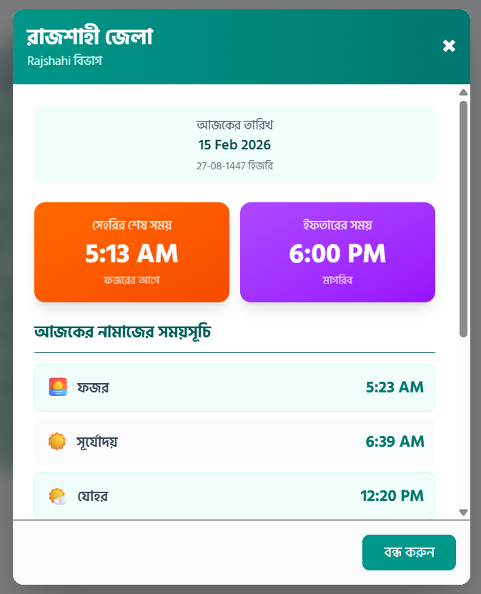

# 🕌 Bangladesh Prayer Times Map

A beautiful, interactive web application that displays Islamic prayer times (Suhur and Iftar) for all 64 districts of Bangladesh. Built with Next.js and featuring a responsive SVG map with zoom controls.


## ✨ Features

- **Interactive Map**: Click on any district to view prayer times
- **Real-time Prayer Times**: Fetched from AlAdhan API for accurate timings
- **Suhur & Iftar Focus**: Highlighted display of fasting times during Ramadan
- **Responsive Design**: Optimized for both desktop and mobile devices
- **Zoom Controls**: Easy navigation with zoom in/out functionality
- **Bengali Language**: Native Bengali text and interface
- **Modern UI**: Clean, accessible design with smooth animations

## 🚀 Live Demo

[View Live Application](https://map.qarabic.org) *(Replace with your actual deployment URL)*

## 📱 Screenshots

### Desktop View


### Mobile View


### District Modal


## 🛠️ Tech Stack

- **Framework**: [Next.js 16](https://nextjs.org/) - React framework for production
- **Styling**: [Tailwind CSS 4](https://tailwindcss.com/) - Utility-first CSS framework
- **API**: [AlAdhan API](https://aladhan.com/prayer-times-api) - Islamic prayer times
- **Fonts**: [Hind Siliguri](https://fonts.google.com/specimen/Hind+Siliguri) - Bengali-compatible font
- **Analytics**: [Vercel Analytics](https://vercel.com/analytics) - Web analytics
- **Deployment**: [Vercel](https://vercel.com/) - Platform for frontend frameworks

## 📁 Project Structure

```
bangladesh-prayer-map/
├── src/
│   ├── app/
│   │   ├── globals.css          # Global styles and Tailwind imports
│   │   ├── layout.js            # Root layout with font configuration
│   │   └── page.jsx             # Main page component
│   ├── components/
│   │   └── BangladeshMap/
│   │       ├── BangladeshMap.jsx    # Main map component with zoom
│   │       ├── DistrictModal.jsx    # Prayer times modal
│   │       └── Information.jsx      # App info and social links
│   ├── data/
│   │   └── data.js              # District data with coordinates
│   └── utils/
│       └── prayerTimes.js       # API utility for prayer times
├── public/                      # Static assets
├── package.json                 # Dependencies and scripts
├── tailwind.config.js          # Tailwind configuration
├── next.config.mjs             # Next.js configuration
└── README.md                   # Project documentation
```

## 🚀 Getting Started

### Prerequisites

- Node.js 18+ and npm
- Git

### Installation

1. **Clone the repository**
   ```bash
   git clone https://github.com/miftahulislam2023/qarabic-prayer-map-bd-2026.git
   cd bangladesh-prayer-map
   ```

2. **Install dependencies**
   ```bash
   npm install
   ```

3. **Run the development server**
   ```bash
   npm run dev
   ```

4. **Open your browser**
   ```
   http://localhost:3000
   ```

### Build for Production

```bash
npm run build
npm start
```

## 🎯 How It Works

1. **Map Interaction**: Users can click on any district in the interactive SVG map
2. **API Integration**: Prayer times are fetched in real-time using coordinates of each district
3. **Modal Display**: A beautiful modal shows all prayer times with special highlighting for Suhur and Iftar
4. **Responsive Design**: The interface adapts seamlessly across different screen sizes

## 📊 API Usage

The app uses the [AlAdhan Prayer Times API](https://aladhan.com/prayer-times-api) which provides:

- Accurate prayer times based on geographical coordinates
- Islamic calendar dates (Hijri)
- Multiple calculation methods
- Global coverage

### API Endpoint Example

```javascript
GET https://api.aladhan.com/v1/timings/15-2-2024?latitude=23.8103&longitude=90.4125&method=1
```

## 🎨 Customization

### Adding New Districts

Edit `src/data/data.js` to add new districts with their coordinates:

```javascript
newDistrict: {
  name: "নতুন জেলা",
  division: "Division Name",
  coordinates: { lat: 23.1234, lng: 90.5678 },
  // ... other properties
}
```

### Styling Changes

Modify Tailwind classes in component files or update `src/app/globals.css` for global styles.

### API Configuration

Adjust prayer time calculation methods in `src/utils/prayerTimes.js`.

## 🤝 Contributing

Contributions are welcome! Please feel free to submit a Pull Request.

1. Fork the project
2. Create your feature branch (`git checkout -b feature/AmazingFeature`)
3. Commit your changes (`git commit -m 'Add some AmazingFeature'`)
4. Push to the branch (`git push origin feature/AmazingFeature`)
5. Open a Pull Request

## 📄 License

This project is licensed under the MIT License - see the [LICENSE](LICENSE) file for details.

## 🙏 Credits & Acknowledgments

### Map Data
Special thanks to [Sawom](https://github.com/Sawom) for providing the Bangladesh map SVG data and district information that forms the foundation of this project.

**Original Repository**: [https://github.com/Sawom/Bangladesh-Map.git](https://github.com/Sawom/Bangladesh-Map.git)

### Prayer Times API
- [AlAdhan](https://aladhan.com/) - Islamic prayer times API

### Fonts
- [Hind Siliguri](https://fonts.google.com/specimen/Hind+Siliguri) - Google Fonts

## 👨‍💻 Developer

**QArabic - Developed by MiftahCoding**

This project is open source and available under the MIT License.

### Connect with us:
- **GitHub**: [Miftahul Islam Github](https://github.com/miftahulislam2023/)
- **LinkedIn**: [Miftahul Islam Linkedin](https://www.linkedin.com/in/miftahulislambd/)

## 📞 Support

If you have any questions or need help, please open an issue on GitHub or contact the developer.

## 🔄 Updates

### Version 0.1.0
- Initial release with prayer times functionality
- Interactive map with zoom controls
- Responsive design for mobile and desktop
- Bengali language support
- Real-time API integration

---

<div align="center">

**Made with ❤️ for the Muslim community of Bangladesh**

🕌 **May Allah accept our efforts** 🕌

</div>
